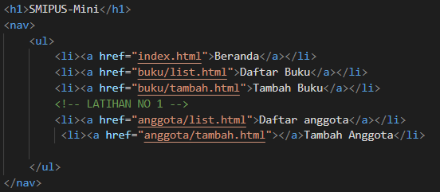
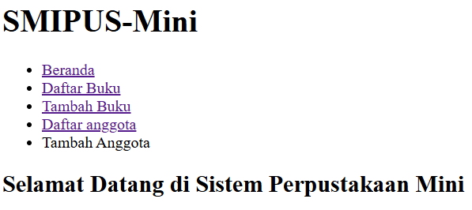
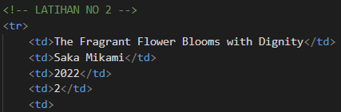
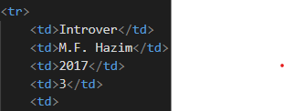
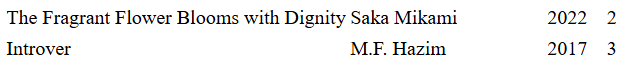
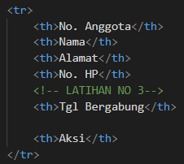
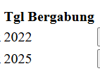
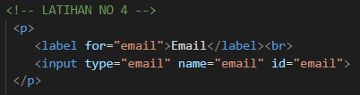

| Design and Programing Web |
|--|--|
| NIM |  254107020093|
| Nama |  Ferdyansah Prakoso |
| Kelas | TI - 2D |
| Repository | [link] (https://github.com/ferthereaper/DnPWeb.git) |

# JOBSHEET 1 HTML5 Semantic Skeleton

## IDE LATIHAN
### 1.1 Lengkapi konsistensi menu
#### 1.2a Kode

### 1.2b output

### 2.1 Tambah 2 baris data buku baru
### 2.2a Kode

### 2.2b Output

### 3.1 Tambah kolom baru di tabel anggota
### 3.2a Kode

### 3.2b Output

### 4.1 Tambah field baru di form tambah anggota
### 4.2a Kode

### 4.2b Output

