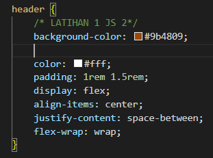
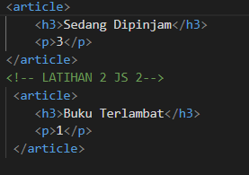
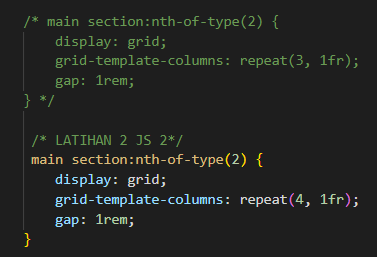
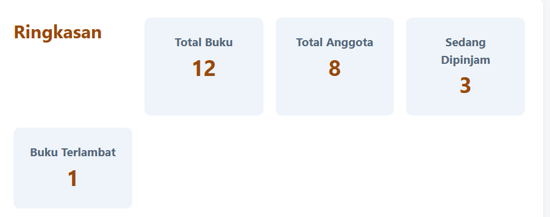
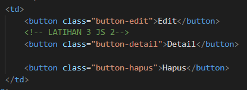
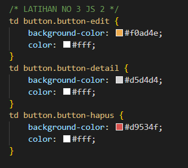
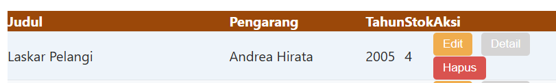
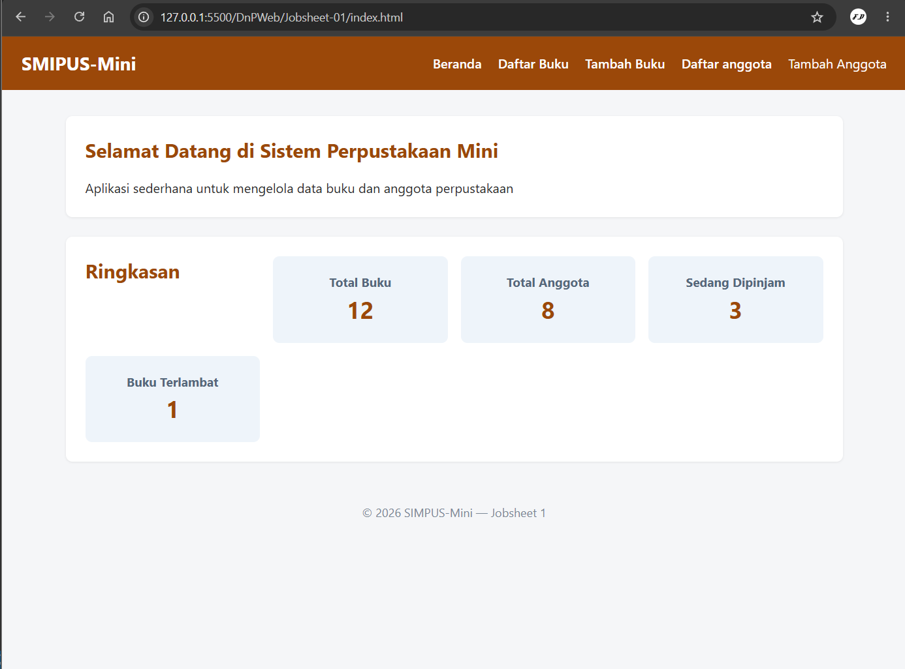
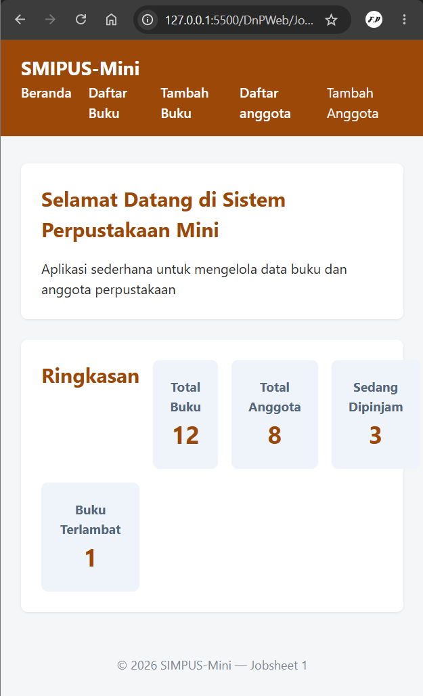

| Design and Programing Web |
|--|--|
| NIM |  254107020093|
| Nama |  Ferdyansah Prakoso |
| Kelas | TI - 2D |
| Repository | [link] (https://github.com/ferthereaper/DnPWeb.git) |
# JOBSHEET 2 CSS3 Syling Dasar

## IDE LATIHAN
### 1.1 Ubah Skema Warna
#### 1.2a Kode

### 1.2b output

### 2.1 Tambah kolom keempat di grid kartu statistik
### 2.2a Kode

### 2.2b Output

### 3.1 Buat tombol ketiga di tabel
### 3.2a Kode

### 3.2b Output

### 4.1 uji responsivitas sederhana
### 4.2b Output

