| Design and Programing Web |
|--|--|
| NIM |  254107020093|
| Nama |  Ferdyansah Prakoso |
| Kelas | TI - 2D |
| Repository | [link] (https://github.com/ferthereaper/DnPWeb.git) |
# JOBSHEET 3 CSS3 Syling Dasar

## 1. Tambah <meta name="viewport"> di semua halaman
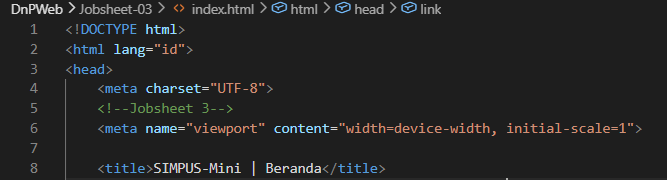

## 2. Navbar: hamburger menu memakai teknik checkbox hack murni CSS (input[type=checkbox] + label), aktif di layar ≤480px.
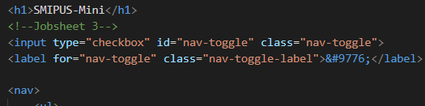

## 3. Tabel dibungkus 
 agar bisa di-scroll horizontal di layar sempit.
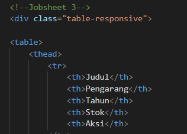
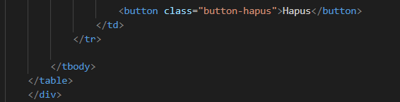

## 4. Tambah media query di style.css: grid kartu statistik 3 → 2 → 1 kolom mengikuti breakpoint tablet/mobile.
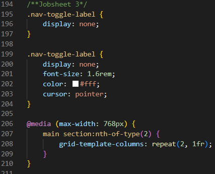
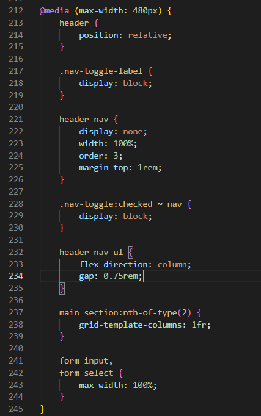

# IDE LATIHAN
## 1.1 Tambah breakpoint baru
## 1.2a Kode
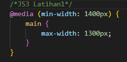
## 1.2b output

## 2.1 Ubah breakpoint tablet dari 768px menjadi 900px
## 2.2a Kode
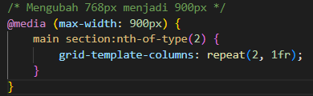
## 2.2b Output

## 3.1 Terapkan pola table-responsive ke elemen lain yang berpotensi melebar di layar sempit
## 3.2a Kode & Output
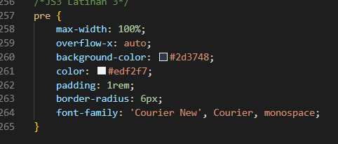

## 4.1 Ubah posisi ikon hamburger
## 4.2b Kode & Output
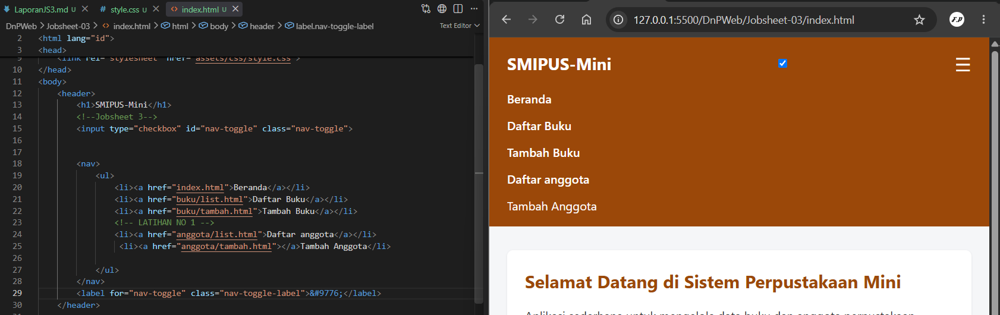

## 5.1 Bandingkan dengan pendekatan mobile-first
## 5.2a Kode & Output
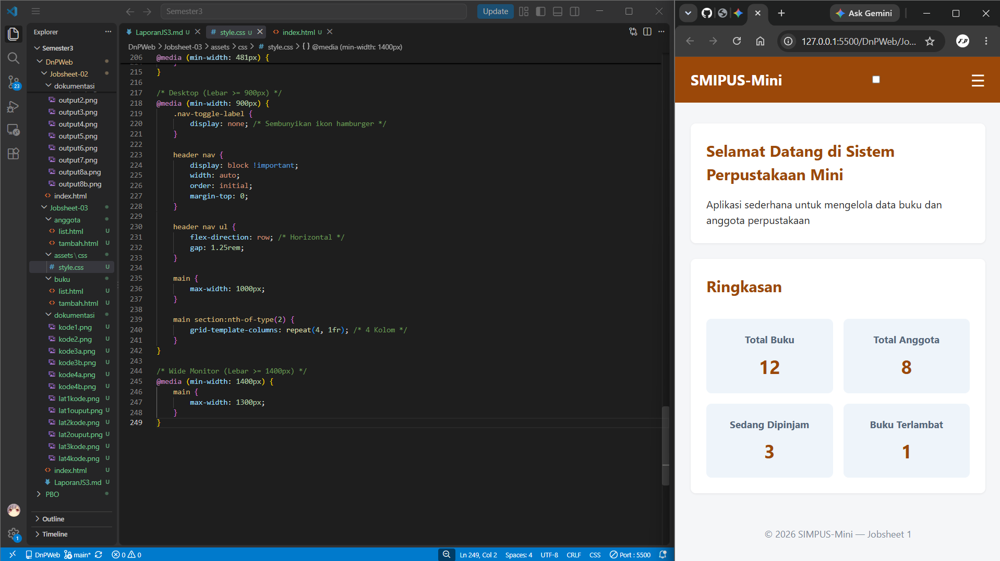

