| Design and Programing Web |
|--|--|
| NIM |  254107020093|
| Nama |  Ferdyansah Prakoso |
| Kelas | TI - 2D |
| Repository | [link] (https://github.com/ferthereaper/DnPWeb.git) |
# JOBSHEET 5 JavaScript DOM & Event

## Tambah assets/js/app.js
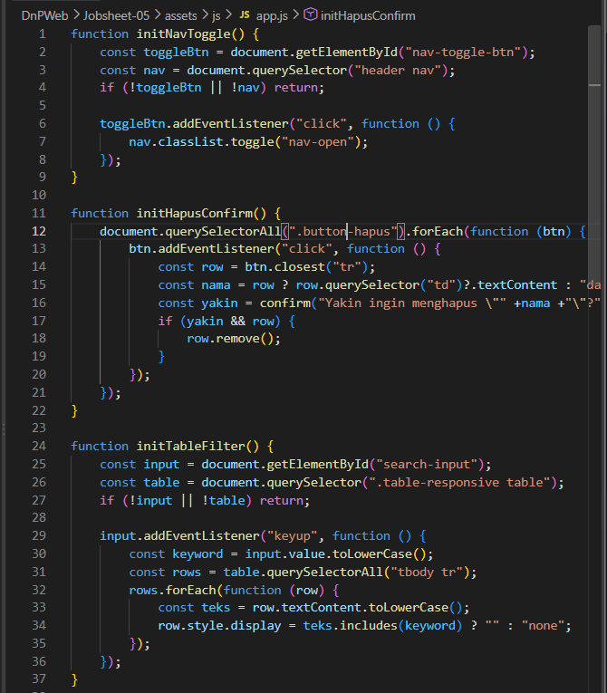
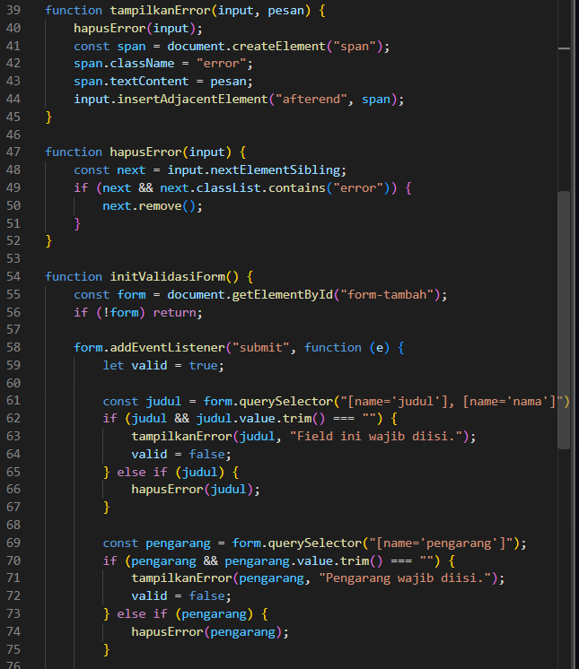
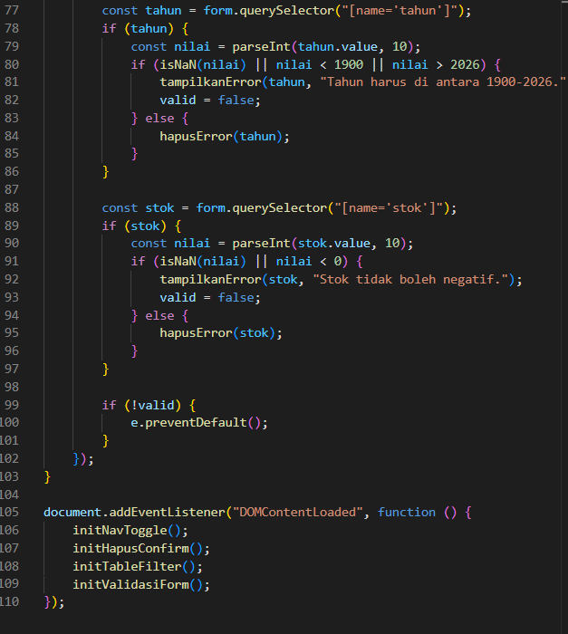

## Hasil
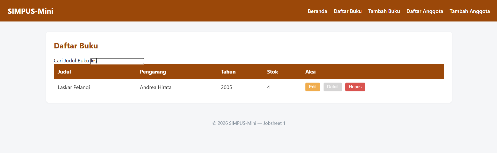
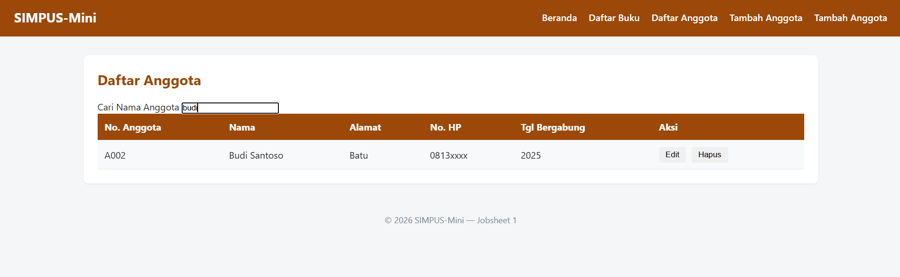
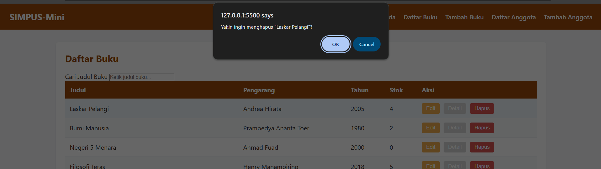
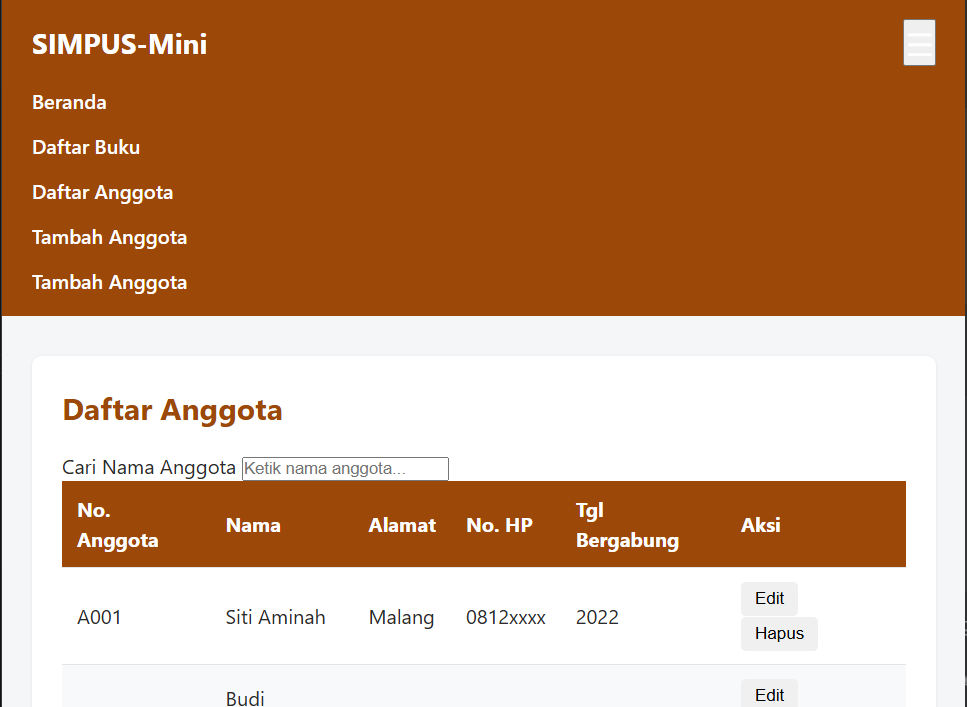

## Latihan
### 1. Tambah validasi field baru
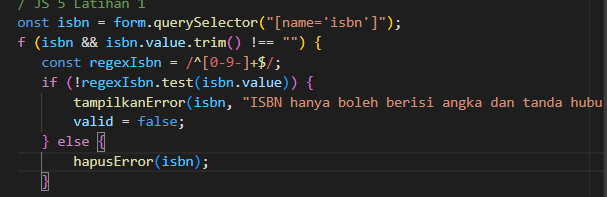
### 2. Tambah animasi sederhana pada initNavToggle
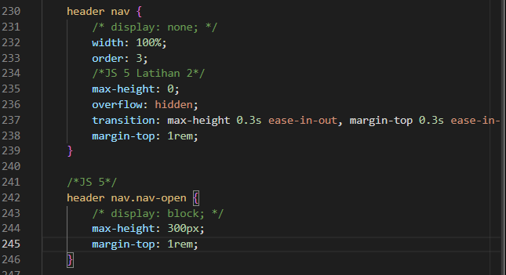
### 3. Perluas initTableFilter
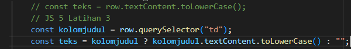
### 4. Tambah counter jumlah baris tersisa setelah difilter atau dihapus 
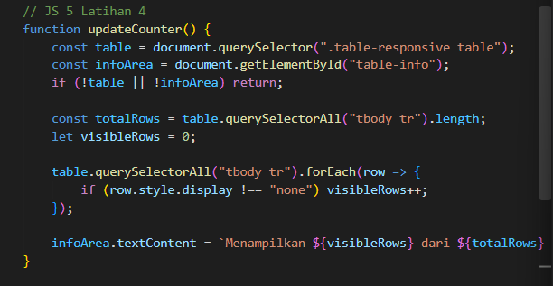
### 5. Refactor validasi
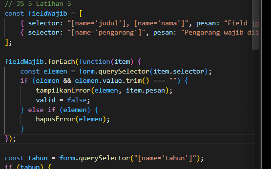

