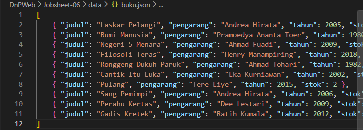
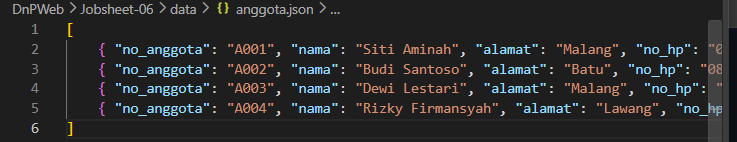
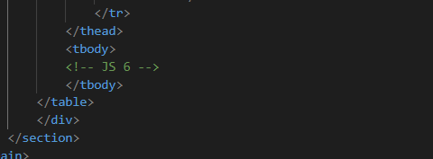
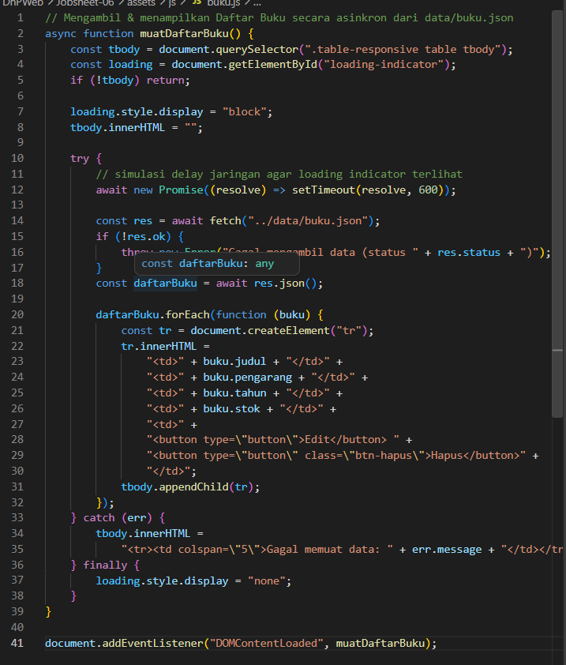
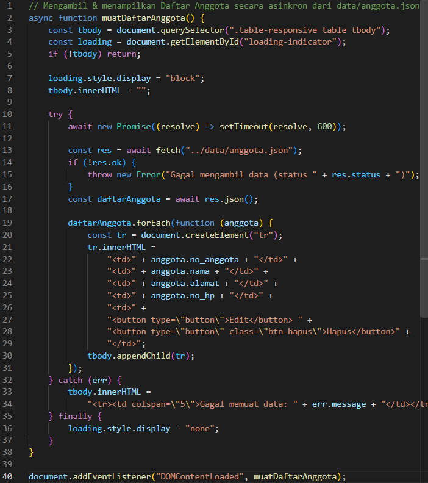
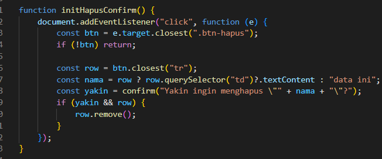
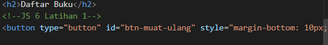
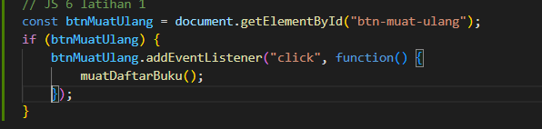
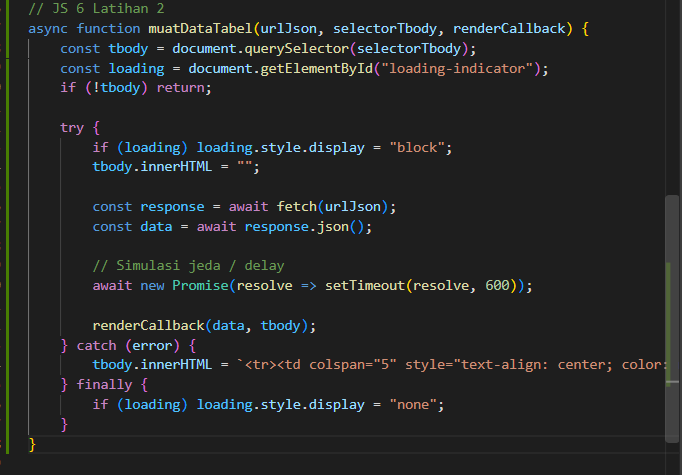
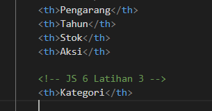

| Design and Programing Web |
|--|--|
| NIM |  254107020093|
| Nama |  Ferdyansah Prakoso |
| Kelas | TI - 2D |
| Repository | [link] (https://github.com/ferthereaper/DnPWeb.git) |
# JOBSHEET 6 Fetch API & JSON

## Tambah data

## Pengosongan list.html

## Loading indicator

## Event delegation

## Latihan
### 1. Tambah tombol muat ulang

### 2. Satukan buku.js dan anggota.js

### 3. Tambah kolom baru

