| Design and Programing Web |
|--|--|
| NIM |  254107020093|
| Nama |  Ferdyansah Prakoso |
| Kelas | TI - 2D |
| Repository | [link] (https://github.com/ferthereaper/DnPWeb.git) |
# JOBSHEET 7 PHP Dasar & Form Handling

## Folder Utama
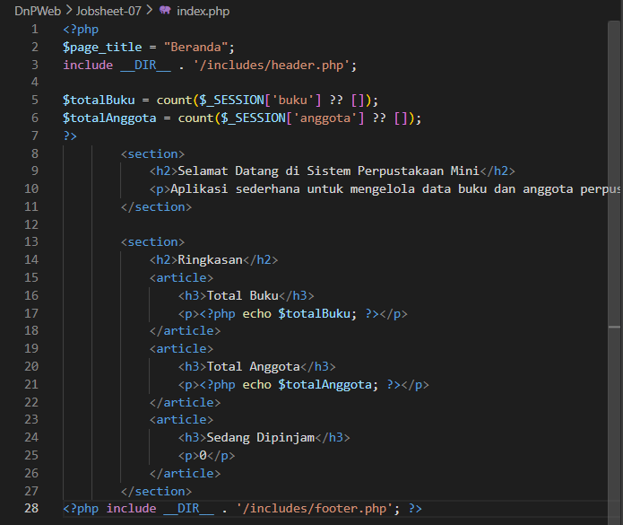

## Folder Includes
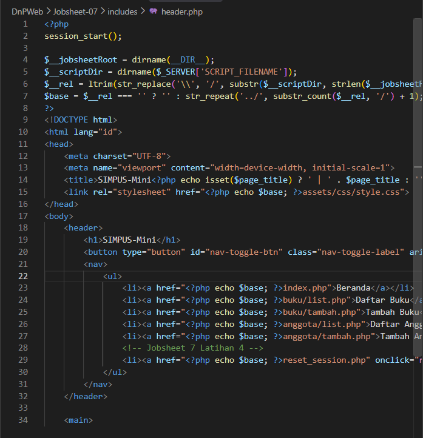
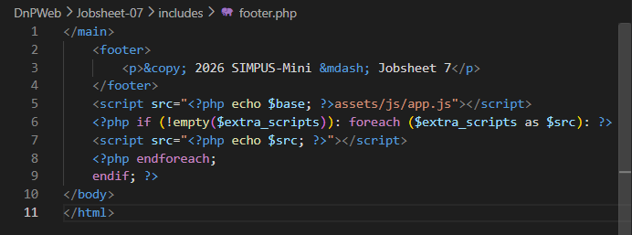

## Folder Buku
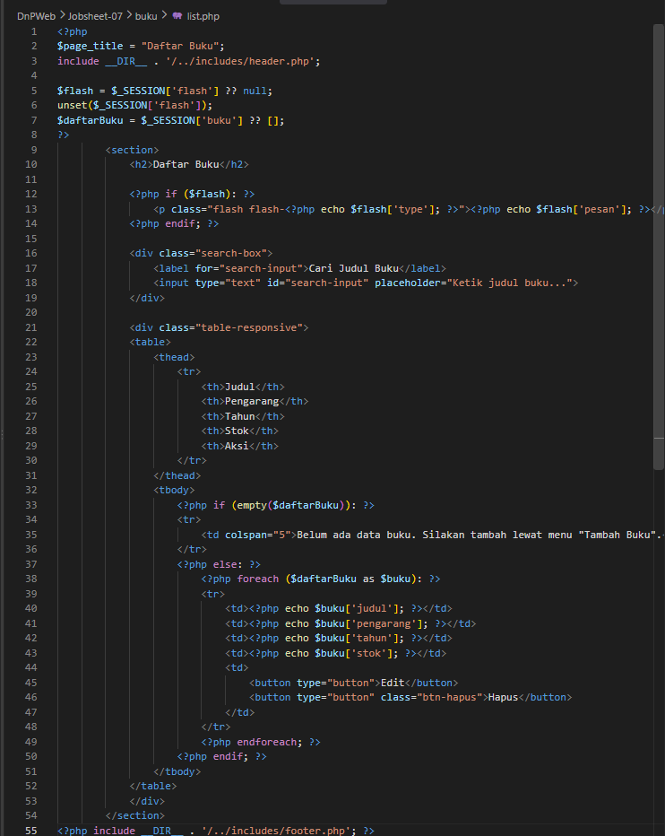
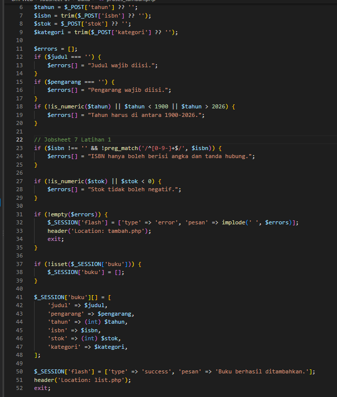
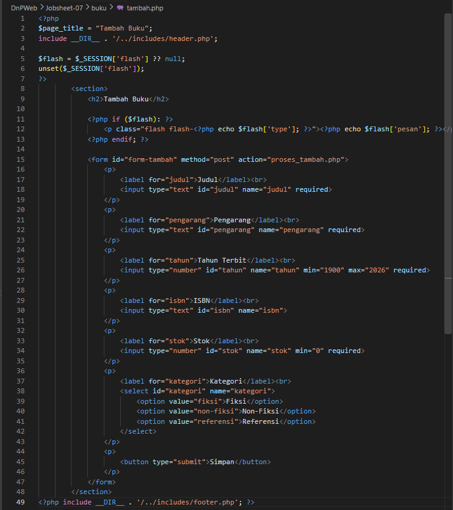

## Folder Anggota
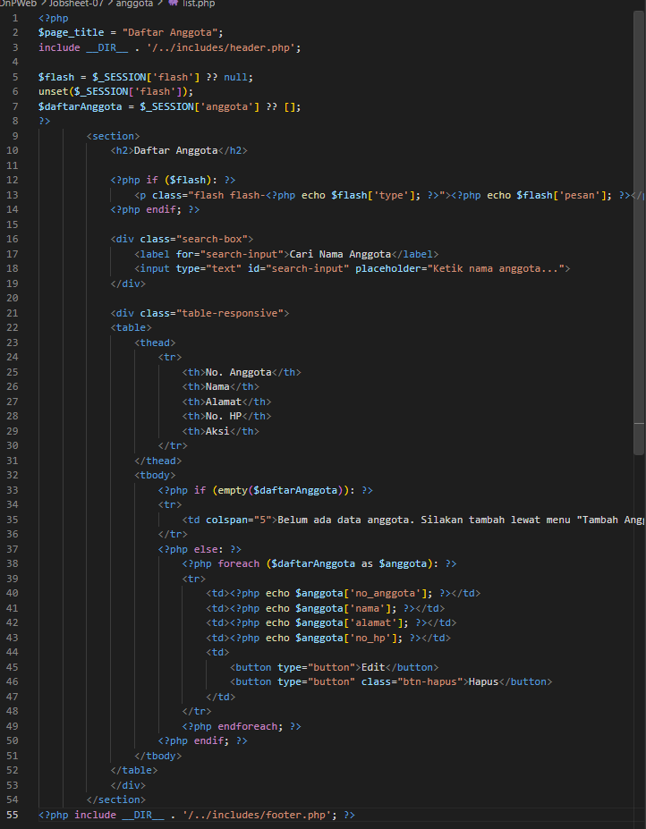
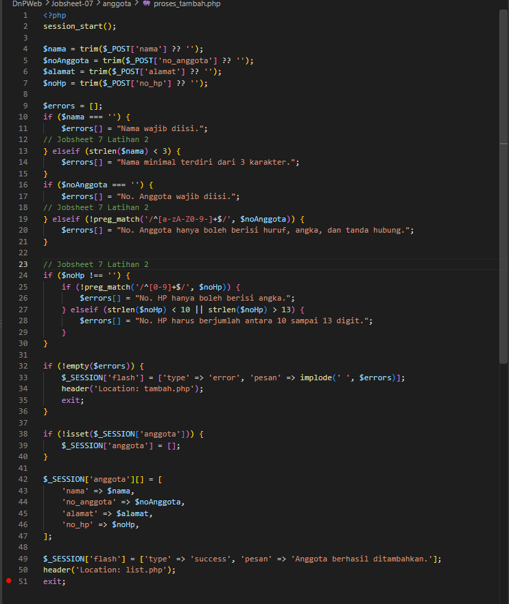
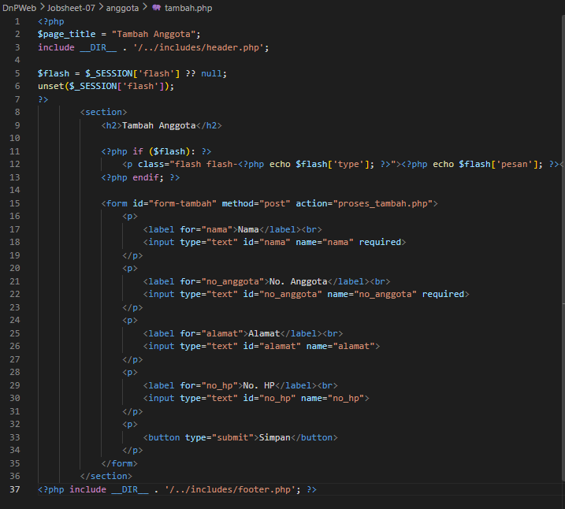

## Latihan
### 1. Tambah validasi ISBN di buku/proses_tambah.php
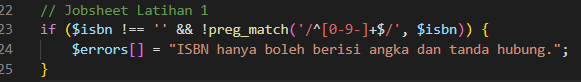

### 2. Tmabah flash message di anggota/proses_tambah.php
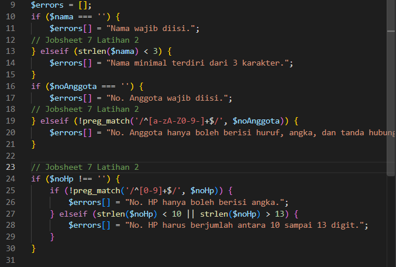

### 3. Buat halaman debug_session.php
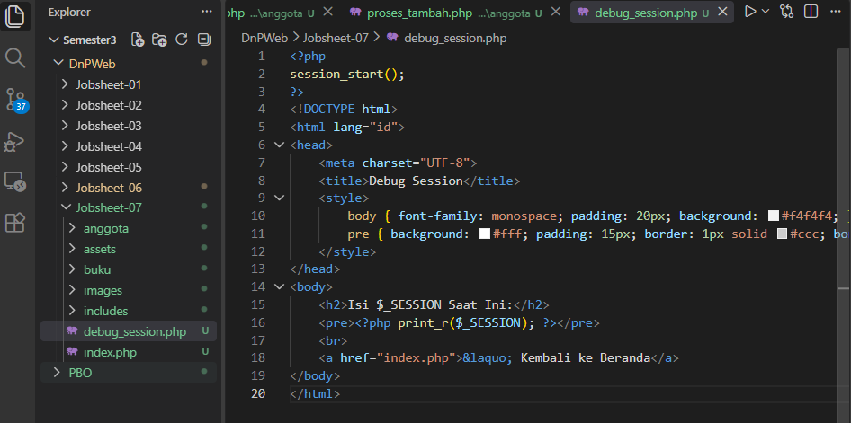
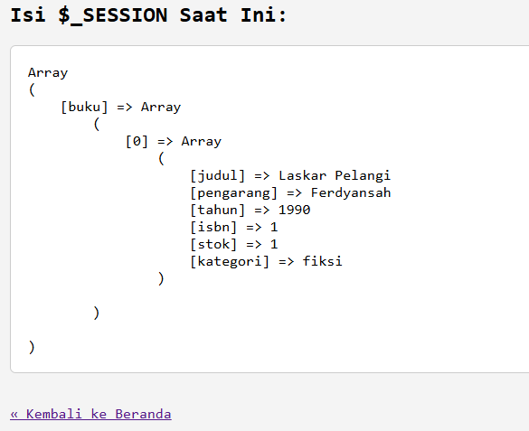

### 4. Tambah tombol "Reset Data"
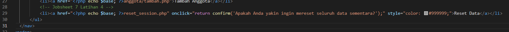
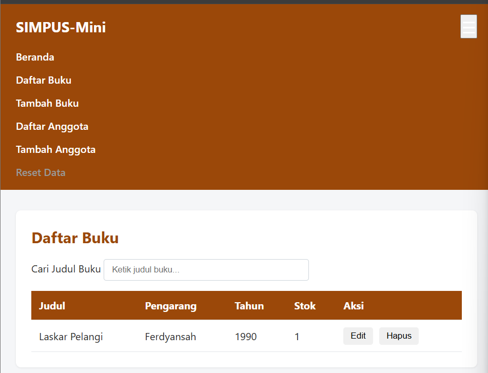

